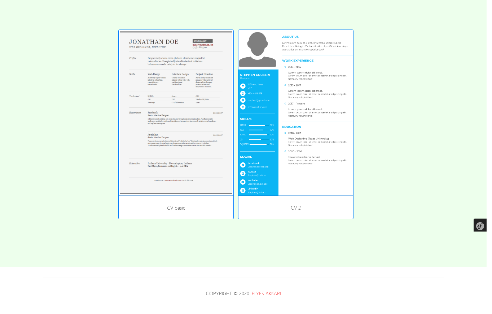
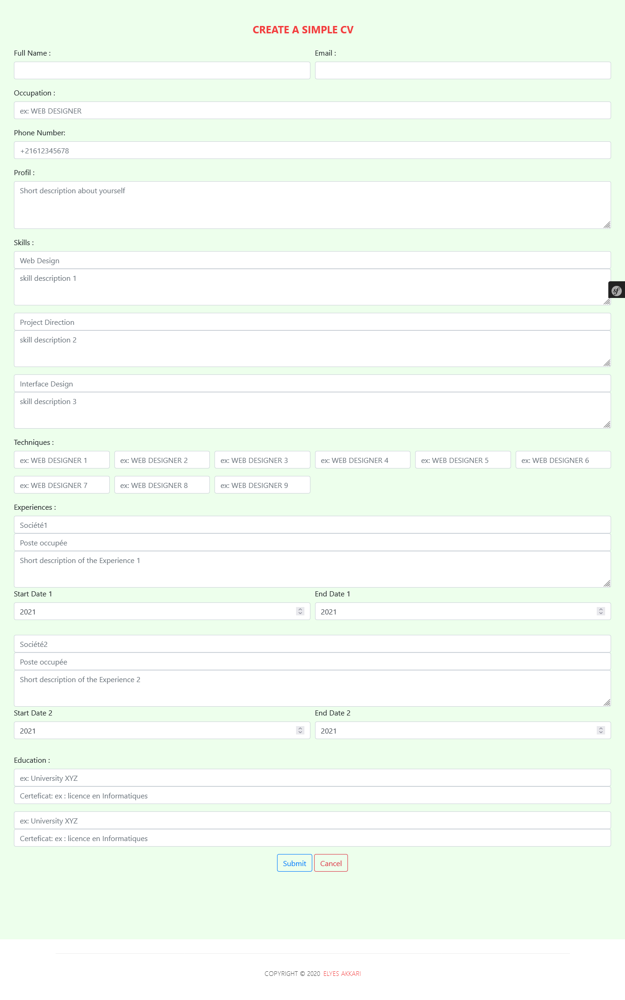

<div id="top"></div>

# Symfony 4 : Cv/Resume Generator

 <!-- TABLE OF CONTENTS -->
<details>
  <summary>Table of Contents</summary>
  <ol>
    <li>
      <a href="#about-the-project">About The Project</a>
      <ul>
        <li><a href="#built-with">Built With</a></li>
      </ul>
    </li>
    <li>
      <a href="#getting-started">Getting Started</a>
      <ul>
        <li><a href="#prerequisites">Prerequisites</a></li>
        <li><a href="#installation">Installation</a></li>
      </ul>
    </li>
    <li><a href="#usage">Usage</a></li>
    <li><a href="#contact">Contact</a></li>
  </ol>
</details>


<!-- ABOUT THE PROJECT -->
## About The Project



A simple Symfony4 project that gives users the possibility to create a pdf CV / Resume by just filling a form.

<p align="right">(<a href="#top">back to top</a>)</p>

### Built With

This project was made using :

* [Symfony4](https://symfony.com/4)
* [twig](https://twig.symfony.com/)
* [php](https://www.php.net/)
* [Bootstrap](https://getbootstrap.com)
* [KnpSnappyBundle](https://github.com/KnpLabs/KnpSnappyBundle)

<p align="right">(<a href="#top">back to top</a>)</p>

## Getting Started

This is an example of how you may give instructions on setting up your project locally.
To get a local copy up and running follow these simple example steps.

### Prerequisites

In ordeer to be able to use this repository  you have to make sure you have 'composer' installed.
* composer
  ```sh
  https://getcomposer.org/download/
  ```
  
### Installation

_Below is an example of how you can download and set up the app._

1.Clone the repo
   ```sh
   git clone https://github.com/ElyesAkkari/CV_Resume-Generator.git
   ```

2.Install Symfony Web Serveur
   ```sh
   cd CV_Resume-Generator
   composer require symfony/web-server-bundle
   ```
3.Install KnpSnappyBundle
   ```sh
   composer require knplabs/knp-snappy-bundle
   ```
    
4.Run the project
   ```sh
   php bin/console server:run
   ```
   
<p align="right">(<a href="#top">back to top</a>)</p>

<!-- USAGE EXAMPLES -->
## Usage

Simple to use web site, once you run the project you'll be directed to the home page in which you'll be able to choose the template you'd like to use.

Then you'll have to fill the form with your details.



Once you click on `Submit` your download will start.

<p align="right">(<a href="#top">back to top</a>)</p>

<!-- CONTACT -->
## Contact

Elyes Akkari - [Linkedin](https://www.linkedin.com/in/elyes-akkari-26013a1b9/)

GitHub: [Elyes Akkari](https://github.com/ElyesAkkari)

<p align="right">(<a href="#top">back to top</a>)</p>
